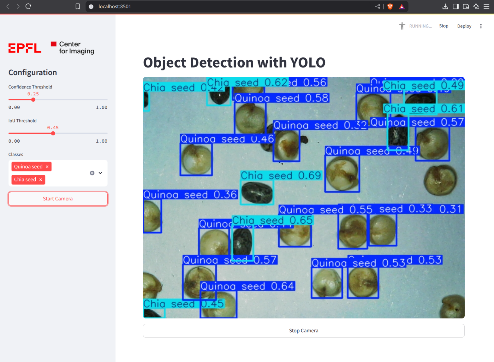

# Object Detection with Ultralytics YOLO

Material for the 2025 EIAS Workshop of introduction to object detection with Ultralytics YOLO.

↗️ [Workshop instructions](https://epfl-center-for-imaging.github.io/yolo-workshop/)

## License

This workshop material is distributed under the terms of the [BSD-3](http://opensource.org/licenses/BSD-3-Clause) license.