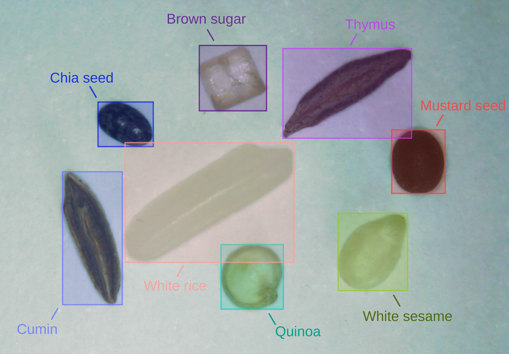
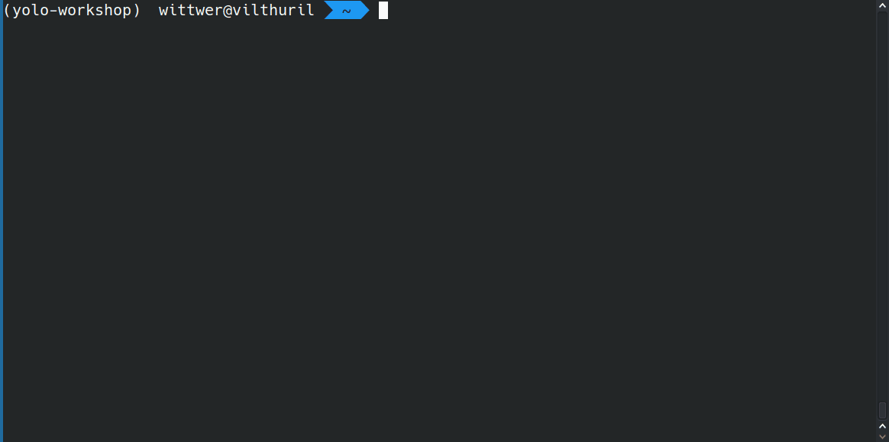
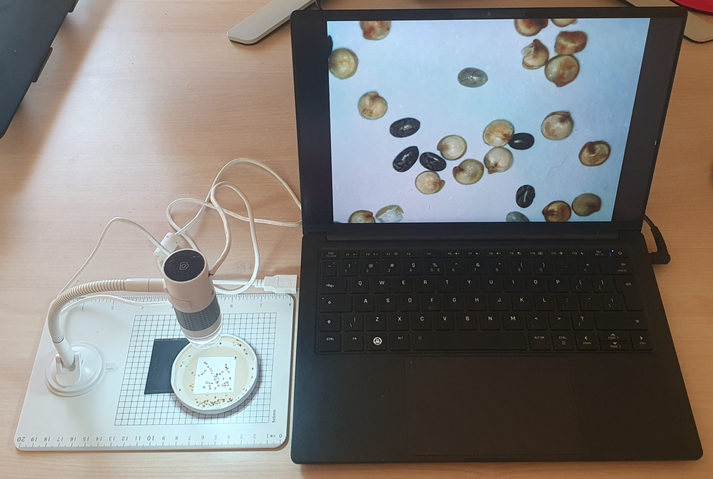

# Object Detection with Ultralytics YOLO

This workshop will introduce you to the fundamental concepts of object detection and guide you through the steps of acquiring images, annotating them, training a model, and testing it with live inference. While our focus will be on object detection, the workflows for segmentation, classification, and other tasks follow similar principles (for more details, see [Ultralytics Tasks](https://docs.ultralytics.com/tasks/) in your own time).


We will use a system based on the [YOLO](https://en.wikipedia.org/wiki/You_Only_Look_Once) algorithm, which is a state-of-the-art method for real-time object detection. YOLO is particularly lightweight, usually offers good performance, and requires few images for training, making it a particularly useful tool for a variety of applications in computer vision and scientific image analysis.

We will apply this to our USB microscopes and train a model to automatically recognize different kinds of seeds and spices from your kitchen 🫘.



## Python Setup

We will use the YOLO implementation from the [Ultralytics](https://ultralytics.com/) Python library, which provides a variety of tools to train, validate, and work with YOLO models. 

To install Ultralytics, 
you will need Python installed on your system. We recommend using a fresh Python virtual environment to follow best practices (for more details, see our [Python setup guide](https://imaging.epfl.ch/field-guide/sections/python/notebooks/python_setup.html#create-a-python-virtual-environment)).

```{admonition} Verify Your Installation
Run `python -V` in your terminal to display your Python version, which should be `3.8` or higher.
```



Next, install the `ultralytics` library in your Python environment:

```
pip install "ultralytics[solutions]"
```

```{note}
The `[solutions]` option is usually optional - it installs a few additional dependencies, including [Streamlit](https://streamlit.io/), which we will use for running live inference in a web browser.
```

```{admonition} Verify Your Installation
Run `yolo checks` in your terminal. This command should display some information about the installed package.
```

For advanced or custom installation of Ultralytics, refer to their [Quickstart Guide](https://docs.ultralytics.com/quickstart/).

## Camera Setup

To train and test your object detection model, you will need:

- A USB microscope, webcam, or similar device
- Objects to capture images of (e.g., quinoa, chia seeds, sand grains, or other small items)



You should also ensure to have a way to starting the camera and capturing images.

`````{tab-set}
````{tab-item} Windows
Open the `Camera` app from the Start menu.
````
````{tab-item} Mac
Open the `Photo Booth` app from the Applications folder.
````
````{tab-item} Linux
1. Install [Cheese](https://en.wikipedia.org/wiki/Cheese_(software)) using `sudo apt install cheese`.
2. Launch it from the terminal with the `cheese` command.
````
`````

## Overview

In this workshop, you'll have an opportunity to practice a standard computer vision workflow, which includes the steps illustrated in the diagram below.

```{mermaid}
flowchart LR
    A(🔬 Acquisition) --> B(🖌️ Annotation)
    B --> C(🎓 Training)
    C --> D(⚖️ Validation)
    D --> E(🔋 Inference)
```

Now that you're set up, let's dive in - starting with acquiring some training images.