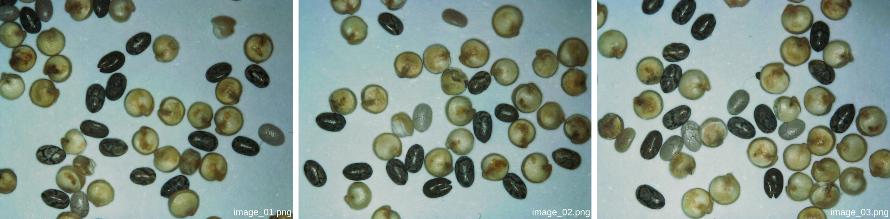

# Create a training set of images

```{margin}
Estimated time for this step: 10-15 minutes.
```

You should start by collecting a set of representative images of the objects you'd like to detect. For a first try, we recommend that you take **five** images for training and **two** for validation. You should vary the "scene" by placing different objects in the field of view for each image. You can keep the magnification fixed between the images.



```{tip}
Keep in mind that you'll have to manually annotate the objects in the next step. Try not to have much more than 5-10 objects of each kind in each image, so that you won't spend all of your time annotating them!
```

Organize your images into a dedicated folder named `dataset` on your computer. Within this folder, create a subfolder called `images`, and further divide it into `train` for training images and `val` for validation images. The file names don't matter. Tou can save the images in either `png`, `jpeg`, or `tif` format (they should be RGB colored images).

Here’s an example of how your dataset folder structure should look:

```
dataset
|---- images
        |---- train
             |---- image_01.png
             |---- image_02.png
             |---- ...
             |---- image_05.png
        |---- val
             |---- image_01.png
             |---- image_02.png
```

```{admonition} Tips for acquiring a good training set


- The more images in your training set, the better. However, when you fine-tune your model from a pretrained model, as we'll do, you probably won't need a many images.

- The more variety in your training set, the better. It should reflect the conditions under which the model will operate. For instance, if variations in illumination, focus, or magnification are expected when using the model, similar variations should be captured in the training set.
```
