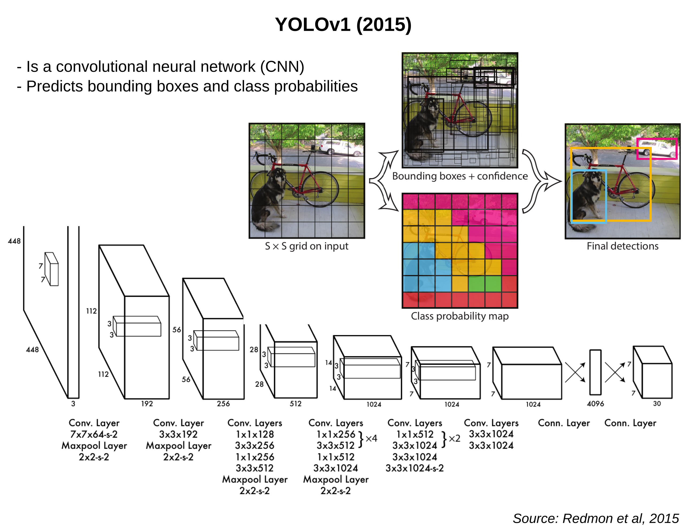
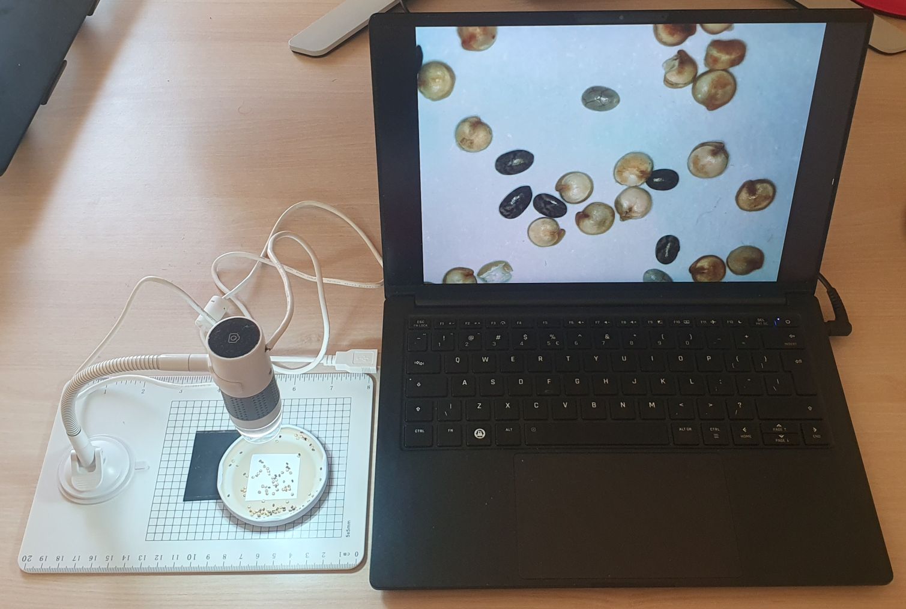
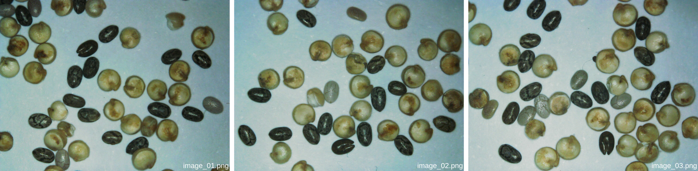
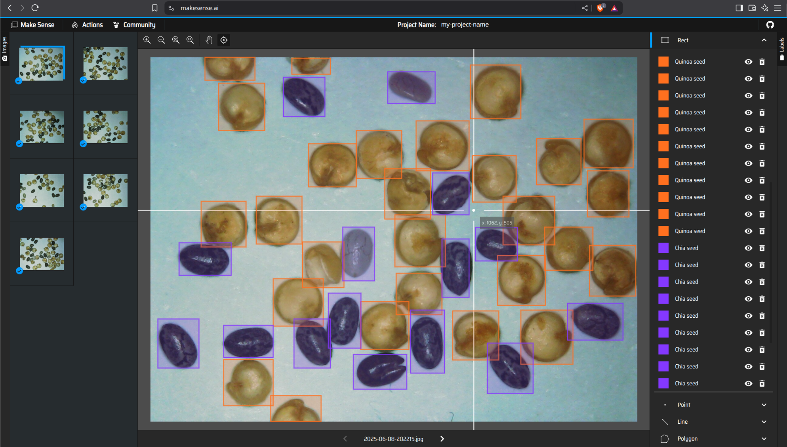
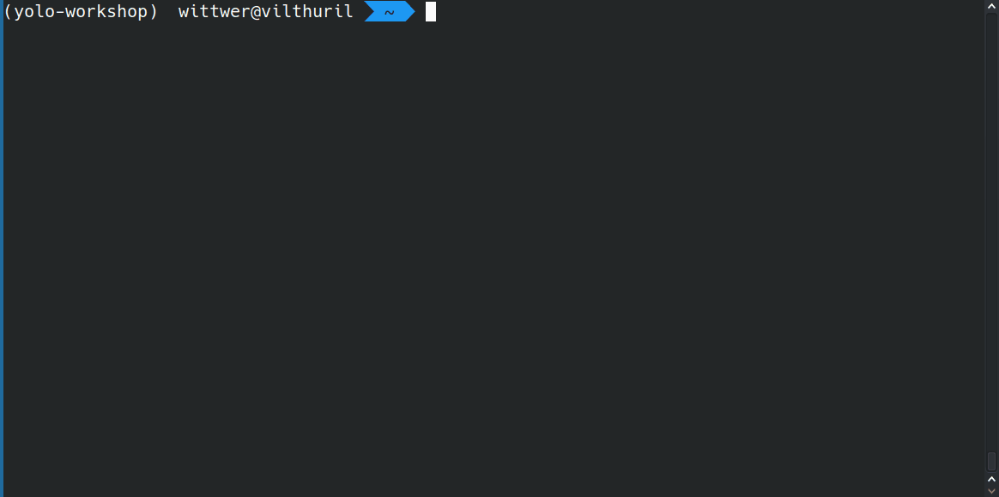
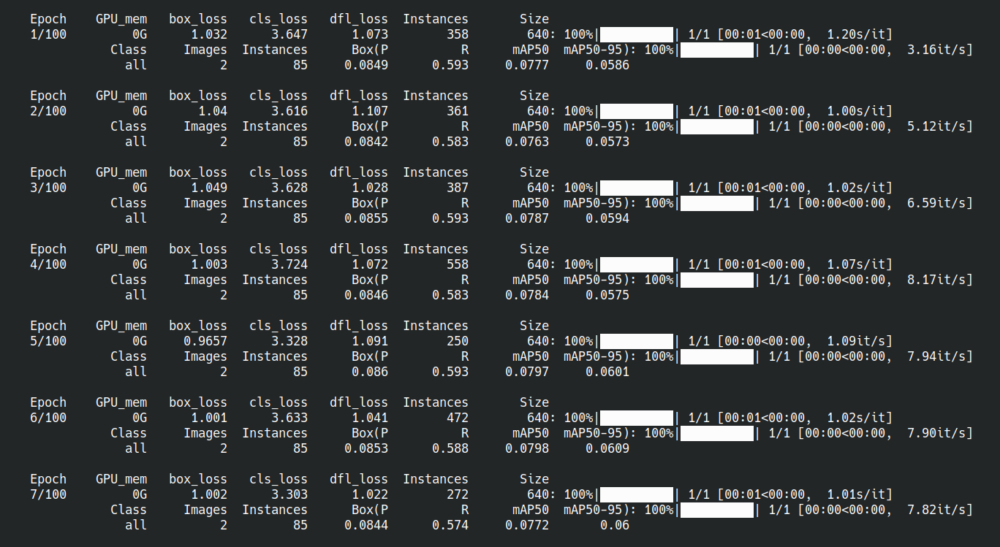

# Object Detection with YOLO

Online version of this guide: https://go.epfl.ch/yolo-workshop

In this workshop, we'll go through the steps of acquiring images, annotating them, training an object detection model, and testing it in real time on USB microscopes.

```{mermaid}
flowchart LR
    A(🔬 Acquisition) --> B(🖌️ Annotation)
    B --> C(🎓 Training)
    C --> D(⚖️ Validation)
    D --> E(🔋 Inference)
```


We will implement a system based on a [YOLO](https://en.wikipedia.org/wiki/You_Only_Look_Once) model, which is a state-of-the-art method for real-time object detection. YOLO models usually offer good performance and require few images for training, making them particularly useful for applications in computer vision and scientific image analysis.

```{admonition} How does YOLO work?

The original YOLO model was designed in 2015 ([Redmon et al, 2015](https://doi.org/10.48550/arXiv.1506.02640)); it was a convolutional Neural Network (CNN) that predicted and classified bounding boxes in a single forward pass (hence the name - *You Only Look Once*), enabling fast, real-time predictions.



Since then, more modern versions of the model have been developed (YOLOv2, YOLOv3...), introducing architectural changes and improvements to make the model faster, more accurate, and more versatile ([Models](https://docs.ultralytics.com/models/#featured-models)).
```

In this workshop, we will train a YOLO model to automatically recognize different kinds of seeds from our kitchen, using a USB microscope as a camera device.

### Microscope Setup

To complete this workshop, you will need:

- 🔬 A USB microscope (connected via USB-A)
- 🫘 Some seeds to capture images of (e.g., quinoa, chia)
- 🐍 Python installed on your system



#### Test the microscope

Once plugged in, you should also be able to start the microscope camera and capture images.


- **Windows**: Open the `Camera` app from the start menu. By clicking on the camera icon at the top-right ("Switch camera"), you should be able to select the USB microscope as an input device instead of your webcam.
- **Mac**: Open the `Photo Booth` app from the Applications folder. In the *Settings*, you should be able to select the USB microscope as an input device instead of your webcam.
- **Linux**: Install and use [Cheese](https://en.wikipedia.org/wiki/Cheese_(software)) (for example).

Now that you're set up, let's dive in - starting with acquiring some training images.


## Create a training set of images

You should start by collecting a set of representative images of the objects you'd like to detect. For a first try, we recommend that you take **five** images for training and **two** for validation. You should vary the "scene" by placing different objects in the field of view for each image. You can keep the magnification fixed between the images.



```{tip}
Having 5 to 10 objects of each type in each image should be good enough (keep in mind that you'll have to manually annotate all of them later!).
```

Organize your images into a dedicated folder named `dataset` on your computer. Within this folder, create a subfolder called `images`, and further divide it into `train` for training images and `val` for validation images. You can save your training images under `train` and your validation images under `val`. The images should be in either `png`, `jpeg`, or `tif` format (they should be RGB colored images).

Here’s an example of how your dataset folder structure should look:

```
dataset
|---- images
        |---- train
             |---- image_01.png
             |---- image_02.png
             |---- ...
             |---- image_05.png
        |---- val
             |---- image_06.png
             |---- image_07.png
```

```{admonition} Tips for acquiring a good training set

- It is true that having more images in your training set generally improves performance. However, when fine-tuning a pretrained model (as we will do), we generally need much fewer images than when training a model from scratch.

- You should ensure that your training set is representative of the variety of conditions (lighting, focus, magnification, background) that the model is likely to encounter during operation.
```

## Annotate your images

In this step, you'll annotate the images you've collected for training and validation. Annotation consists in manually creating a "ground truth" for the model to learn from. For object detection, this means drawing rectangular bounding boxes around the objects. Moreover, you can assign class labels to these bounding boxes to categorize them.

There are many tools available for image annotation ([Label Studio](https://github.com/HumanSignal/label-studio), [CVAT](https://github.com/cvat-ai/cvat), [Napari](https://forum.image.sc/t/napari-plugin-for-creating-object-detection-training-data/80622)...). For simplicity, we'll use [Make Sense](https://www.makesense.ai/), a free and open-source web-based tool.



1. Open [Make Sense](https://www.makesense.ai/) in your web browser and click "Get Started" to create a new project.
2. Upload your images (both training and validation) and select the "Object Detection" task.
3. Provide a list of class labels ("quinoa seed", "chia seed"...) for your objects. Then, select "Start project."
4. It is then time to draw bounding boxes around your objects! Try you annotate all discernable objects. It's good if you can draw boxes accurately, however **they don't need to be pixel-perfect**. Try to spend a few minutes per image at most.

```{admonition} While you're annotating

This is the perfect time to get to know your group members better. Why did you choose to participate in this workshop? Can you think of any interesting applications of real-time object detection?
```

5. Once you've annotated all of your images, save your annotations by navigating to `Actions > Export Annotations`. Choose the option to export **A .zip package containing files in YOLO format**.
6. Download and unzip the package. You should see text files (`image_00.txt`, `image_01.txt`, ...) corresponding to each image's annotations.
7. Move the text files into a `labels` subfolder alongside your images (respectively under `train` and `val`). Your dataset structure should look similar to this:

```
dataset
|---- images
     |---- train
          |---- image_01.png
          |---- image_02.png
          |---- ...
          |---- image_05.png
     |---- val
          |---- image_06.png
          |---- image_07.png
|---- labels
     |---- train
          |---- image_01.txt
          |---- image_02.txt
          |---- ...
          |---- image_05.txt
     |---- val
          |---- image_06.txt
          |---- image_07.txt
```

With your annotated dataset ready, you're all set to train your first model.


## Train your model

To train a model, we will use the YOLO implementation from the [Ultralytics](https://ultralytics.com/) Python library, which provides a variety of tools to train, validate, and work with YOLO models.

### Python setup

You should already have Python installed on your system. We recommend using a fresh Python virtual environment to follow best practices (for more details, see our [Python setup guide](https://epfl-center-for-imaging.github.io/python-setup/)).

```{admonition} Verify your installation
Run `python -V` in your terminal to display your Python version. It should be `3.11` or higher.
```

<!--  -->

Next, install the `ultralytics` library in your Python environment:

```
pip install "ultralytics[solutions]"
```

The `[solutions]` option is used to install a few additional dependencies, including [Streamlit](https://streamlit.io/), which we will use for running live inference in a web browser.

```{admonition} Verify your installation
Run `yolo checks` in your terminal. This command should display some information about the installed package.
```

For advanced or custom installation of Ultralytics, refer to their [Quickstart Guide](https://docs.ultralytics.com/quickstart/).

### Create a `dataset.yaml`

To train a model, you also need to create a YAML configuration file named `dataset.yaml`. This file should specify the paths to your training and validation images, as well as the class labels for your model.

Here’s an example of a minimal `dataset.yaml` file:

```yaml
# Object class names
names:
    0: Quinoa seed
    1: Chia seed

# Dataset directory
path: /home/user/yolo-workshop/dataset
train: images/train
val: images/val
```

You can create your own `dataset.yaml` file and save it somewhere on your computer (for example in your `dataset` folder, to keep things tidy).

### Start training

Once you haver your configuration file, you can start the training process by running the following command in your terminal:

```
yolo detect train data=path/to/dataset.yaml model=yolo26n.pt epochs=200 project=/path/to/output
```

This command specifies:

- `data`: the path to your YAML configuration file.
- `model`: the pre-trained YOLO model you want to fine-tune ([docs](https://docs.ultralytics.com/models/yolo26/)).
- `epochs`: the number of training iterations (higher values mean longer training times).
- `project`: where to save the training outputs.

If you wanted, you could customize many more training parameters ([docs](https://docs.ultralytics.com/modes/train/)).

Once training begins, grab a coffee and watch the progress in the terminal ☕.



```{note}
- Notice that you are not training a model from scratch, but rather **fine-tuning** an existing model (`yolo26n.pt`). This model was pre-trained on a large corpus of natural images (the [COCO](https://cocodataset.org/#home) dataset) and could already detect 80 object classes (chair, person, etc.). Fine-tuning a model is generally a more effective way (more robust, converges faster) to learn to detect new objects than training a completely new model from scratch.
- The `project` folder you selected to save the training outputs should contain a few overviews of the training batches (*train_batch--.jpg*). Note that the training images are modified in scale, orientation, brightness, and undergo other types of transforms. Introducing these [data augmentations](https://docs.ultralytics.com/guides/yolo-data-augmentation/) during training helps the model generalize to a wider range of conditions than the limited set represented in the training images.
```

When the training completes, the results will be saved in the directory you've specified as `project`. These results include:

- Visualizations of predictions on the training and validation datasets.
- [Performance metrics](https://docs.ultralytics.com/guides/yolo-performance-metrics/), such as confusion matrices.
- Training and validation loss curves.
- A record of the training parameters.

Most importantly, there should be a `weights` subfolder in the training outputs. It should contain two model weight files in PyTorch format:

- **`best.pt`**: The model weights from the epoch with the best validation score.
- **`last.pt`**: The model weights from the final training epoch.

These weight files are what you need to reload your model and run it on new images.

```{admonition} Do you need a GPU for training?
While having a GPU can significantly speed up the training process, it is not strictly necessary. YOLO models, especially the smaller ones, can often be trained even on a laptop.
```

Next, you'll test your trained model in real time on the microscope!


## Test your model with live inference

Inference is the process of using a trained model to detect objects in new, unseen data. In this section, you'll test your model on a live video feed from your USB microscope.

To test your model, you can use the `predict` command:

```
yolo predict model="/path/to/weights/last.pt" source=1 show=True
```

The `predict` command includes several parameters you can customize ([docs](https://docs.ultralytics.com/modes/predict/)). Here, we've selected:

- **`model`**: the path to your trained model's weights file.
- **`source`**: the input source for inference. Here, `1` represents the camera index for your USB microscope. If `1` doesn't work, try other indices (e.g., `0`, `2`, etc.) until you find the correct one.
- **`show`**: opens a visualization window.

When you run the `predict` command, a window should appear showing a live video feed from the microscope, including bounding box detections and the corresponding object classes.


````{admonition} What if the results aren't great? Train the model a little longer!
Here, we trained the model for only 200 epochs on just 5 annotated images. While this may be enough, the results can often be improved by training the model for ~300 to 500 epochs. To train your model fruther, you can run the `train` command while specifying the weights file from your 200-epoch checkpoint as `model`. For example, to train for an additional 50 epochs, run:

```
yolo detect train model=path/to/weights/last.pt epochs=50 data=dataset.yaml
```
````

## Live inference with Streamlit

To test the model in a Streamlit app in your web browser, you can download our [inference script](https://github.com/EPFL-Center-for-Imaging/yolo-workshop/blob/main/inference_streamlit.py) from the repository.

Then, run it with the following command (specifying the "webcam index" of your USB microscope):

```
streamlit run inference_streamlit.py path/to/weights/last.pt -- --webcam 1
```

The app should run on [http://localhost:5600](http://localhost:5600). You can open this link in your web browser to see the app.


## Conclusion

Congratulations! You are now equipped to apply the concepts and techniques you've learned to your own projects.

Here are a few resources to explore if you'd like to dive deeper into the topics covered:

- [How computers learn to recognize objects instantly (TED Talk, 2017)](https://www.ted.com/talks/joseph_redmon_how_computers_learn_to_recognize_objects_instantly)
- [Key Steps in a Computer Vision Project](https://docs.ultralytics.com/guides/steps-of-a-cv-project)
- [Tips for Model Training](https://docs.ultralytics.com/guides/model-training-tips/)

You could also have a look at the other [tasks](https://docs.ultralytics.com/tasks/) supported by modern YOLO models, for example:

- [Instance Segmentation](https://docs.ultralytics.com/tasks/segment/)
- [Image Classification](https://docs.ultralytics.com/tasks/classify/)

```{admonition} How about licenses?
Ultralytics YOLO is distributed under the [AGPL-3.0](https://www.ultralytics.com/legal/agpl-3-0-software-license) license. This license requires that any software or AI models derived from Ultralytics models must also be open-source and distributed under the same license. Be ready to open-source your entire project!
```

### Authors

This workshop was prepared by the [EPFL Center for Imaging](https://imaging.epfl.ch/) team. Our role is to support imaging science and scientific image analysis at EPFL and beyond. We carry out imaging-related projects locally and in collaboration with other institutions and industrial partners in Switzerland.

For any questions or enquiries, please contact us by email at `imaging@epfl.ch`.