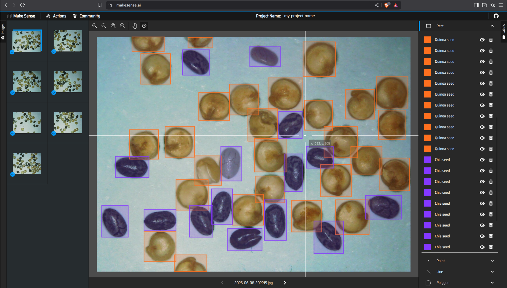

# Annotate your images

```{margin}
Estimated time for this step: 20-25 minutes.
```

In this step, you'll annotate the images you've collected for training and validation. Annotation consists in manually creating a "ground truth" for the model to learn from. For object detection, this means drawing rectangular bounding boxes around objects of interest. Moreover, you can assign class labels to these bounding boxes to categorize the objects.

There are many tools available for image annotation ([Label Studio](https://github.com/HumanSignal/label-studio), [CVAT](https://github.com/cvat-ai/cvat), [Napari](https://forum.image.sc/t/napari-plugin-for-creating-object-detection-training-data/80622), [QuPath](https://gitlab.com/epfl-center-for-imaging/qupath-yolo-toolbox)...). For simplicity, we'll use [Make Sense](https://www.makesense.ai/), a free and open-source web-based tool.



1. Open [Make Sense](https://www.makesense.ai/) in your web browser and click "Get Started" to create a new project.
2. When prompted, upload your images (both training and validation) and select the "Object Detection" task.
3. Provide a list of class labels for your objects. These labels represent the categories of objects you want to detect (e.g., "quinoa seed", "chia seed"...). After entering your labels, click "Start project."
4. The goal is then to draw bounding boxes around objects in your images. Ensure you annotate **all** discernable objects in each image. While you're encouraged to give your best effort, keep in mind that the boxes don't need to be pixel-perfect. Aim to spend a few minutes per image at most.
5. Once you've annotated all your images, save your annotations by navigating to `Actions > Export Annotations`. Choose the option to export **A .zip package containing files in YOLO format**.
6. Download and unzip the package. You should see text files (`image_00.txt`, `image_01.txt`, ...) corresponding to each image's annotations.
7. Move the text files into a `labels` subfolder alongside your images (respectively under `train` and `val`). Your dataset structure should look similar to this:

```
dataset
|---- images
     |---- train
          |---- image_01.png
          |---- image_02.png
          |---- ...
          |---- image_05.png
     |---- val
          |---- image_01.png
          |---- image_02.png
|---- labels
     |---- train
          |---- image_01.txt
          |---- image_02.txt
          |---- ...
          |---- image_05.txt
     |---- val
          |---- image_01.txt
          |---- image_02.txt
```

With your annotated dataset ready, you're all set to train your first model.