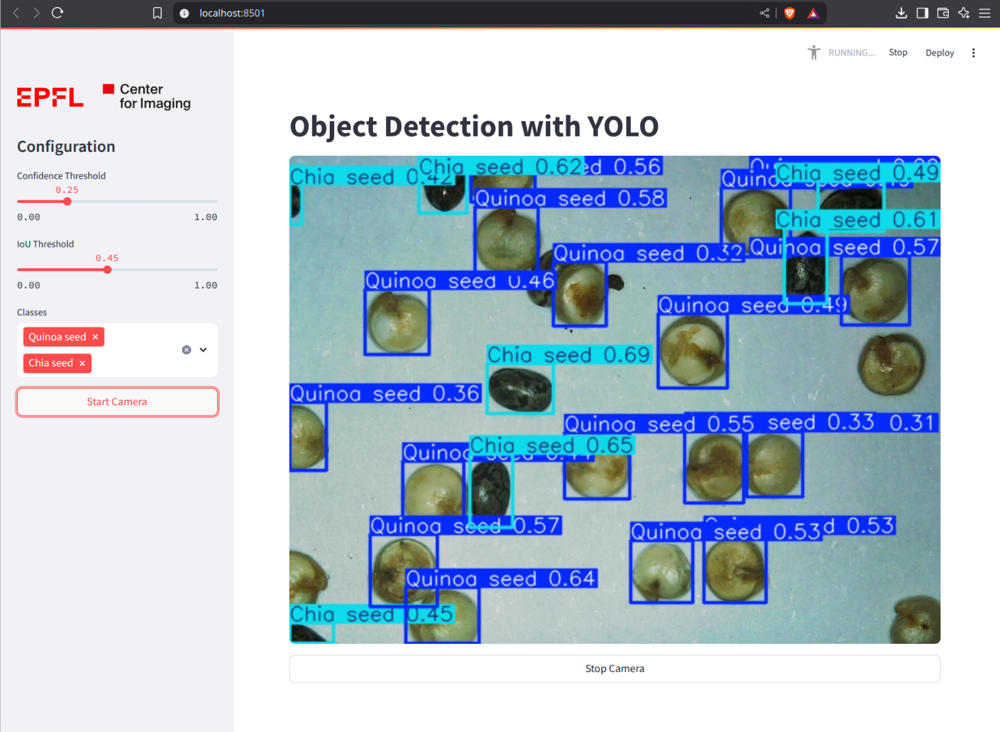

# Test your model with live inference

Inference is the process of using a trained model to detect objects in new, unseen data. In this section, you'll test your model on a live video feed from your USB microscope.

To test your model, you can use the `predict` command:

```
yolo predict model="/path/to/weights/last.pt" source=1 show=True
```

The `predict` command includes several parameters you can customize ([docs](https://docs.ultralytics.com/modes/predict/)). Here, we've selected:

- **`model`**: the path to your trained model's weights file.
- **`source`**: the input source for inference. Here, `1` represents the camera index for your USB microscope. If `1` doesn't work, try other indices (e.g., `0`, `2`, etc.) until you find the correct one.
- **`show`**: opens a visualization window.

When you run the `predict` command, a window should appear showing a live video feed from the microscope, including bounding box detections and the corresponding object classes.


````{admonition} What if the results aren't great? Train the model a little longer!
Here, we trained the model for only 100 epochs on just 5 annotated images. While this may be enough, the results can often be improved by training the model for ~200 to 500 epochs. To train your model fruther, you can run the `train` command while specifying the weights file from your 100-epoch checkpoint as `model`. For example, to train for an additional 50 epochs, run:

```
yolo detect train model=path/to/weights/last.pt epochs=50 data=dataset.yaml
```
````

````{admonition} Live inference with Streamlit
To test the model in a Streamlit app in your web browser, you can download our [inference script](https://github.com/EPFL-Center-for-Imaging/yolo-workshop/blob/main/inference_streamlit.py) from the repository.

Then, run it with the following command (specifying the "webcam index" of your USB microscope):

```
streamlit run inference_streamlit.py path/to/weights/last.pt -- --webcam 1
```

The app should run on [http://localhost:5600](http://localhost:5600). You can open this link in your web browser to see the app.


````
