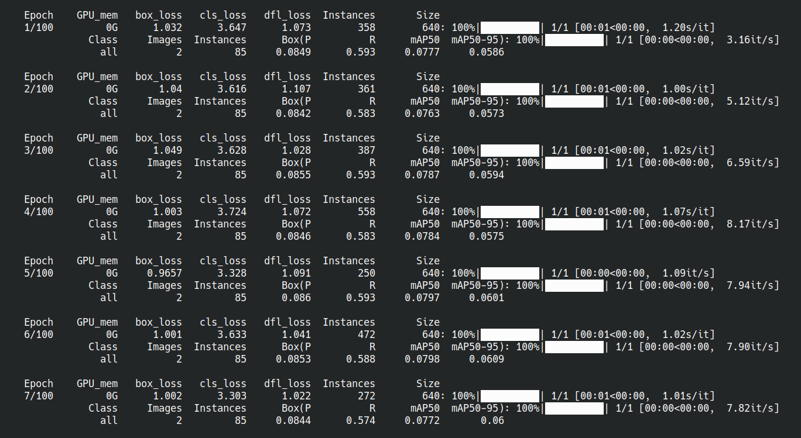

# Train your model

```{margin}
Estimated time for this step: 20-25 minutes.
```

To train your model, you'll use the YOLO command-line interface from the terminal.

To train a model, you first need to create a YAML configuration file named `dataset.yaml`. This file should include the paths to your training and validation image datasets, as well as the class labels for your model.

Here’s an example of a minimal `dataset.yaml` file:

```yaml
# Object class names
names:
    0: Quinoa seed
    1: Chia seed

# Dataset directory
path: /home/user/yolo-workshop/dataset
train: images/train
val: images/val
```

You can create your own `dataset.yaml` file and save it somewhere on your computer (for example in your project's folder, to keep things tidy).

Once you haver your configuration file, you can start the training process by running the following command in your terminal:

```
yolo detect train data=path/to/dataset.yaml model=yolo11n.pt epochs=100 project=/path/to/output
```

This command specifies:

- `data`: the path to your YAML configuration file.
- `model`: the pre-trained YOLO model you want to fine-tune ([docs](https://docs.ultralytics.com/models/yolo11/)).
- `epochs`: the number of training iterations (higher values mean longer training times).
- `project`: where to save the training outputs.

If you wanted, you could customize many more training parameters ([docs](https://docs.ultralytics.com/modes/train/)).

Once training begins, grab a coffee and watch the progress in the terminal ☕.



When the training completes, the results will be saved in the directory you've specified as `project`. These results include:

- Visualizations of predictions on the training and validation datasets.
- [Performance metrics](https://docs.ultralytics.com/guides/yolo-performance-metrics/), such as confusion matrices.
- Training and validation loss curves.
- A record of the training parameters.

Most importantly, you should be able to locate a `weights` subfolder in the training outputs. It should contain two model weight files in PyTorch format:

- **`best.pt`**: The model weights from the epoch with the best validation score.
- **`last.pt`**: The model weights from the final training epoch.

These weight files are what you need to reload your model and run it on new images.

```{admonition} Do You Need a GPU for Training?
While having a GPU can significantly speed up the training process, it is not strictly necessary. For smaller models or if you don't mind longer training times, you can train your model on a CPU-only machine, even on a laptop. If you don't have immediate access to a GPU, don't let this discourage you from experimenting!
```

Next, you'll test your trained model with live inference!