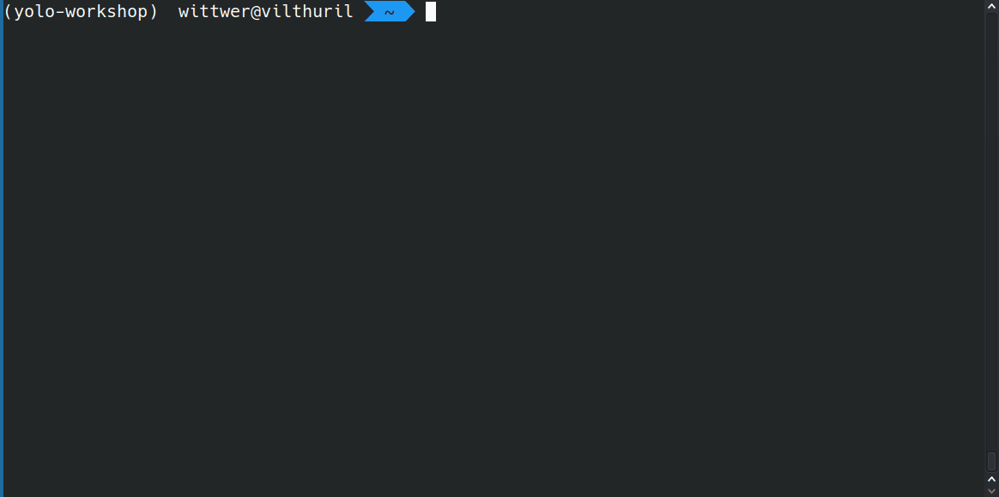

# Train your model

```{margin}
Estimated time for this step: 20-25 minutes.
```

To train a model, we will use the YOLO implementation from the [Ultralytics](https://ultralytics.com/) Python library, which provides a variety of tools to train, validate, and work with YOLO models.

## Python setup

You should already have Python installed on your system. We recommend using a fresh Python virtual environment to follow best practices (for more details, see our [Python setup guide](https://imaging.epfl.ch/field-guide/sections/python/notebooks/python_setup.html#create-a-python-virtual-environment)).

```{admonition} Verify your installation
Run `python -V` in your terminal to display your Python version, which should be `3.8` or higher.
```



Next, install the `ultralytics` library in your Python environment:

```
pip install "ultralytics[solutions]"
```

```{note}
The `[solutions]` option is used to install a few additional dependencies, including [Streamlit](https://streamlit.io/), which we will use for running live inference in a web browser.
```

```{admonition} Verify your installation
Run `yolo checks` in your terminal. This command should display some information about the installed package.
```

For advanced or custom installation of Ultralytics, refer to their [Quickstart Guide](https://docs.ultralytics.com/quickstart/).

## Create a `dataset.yaml`

To train a model, you also need to create a YAML configuration file named `dataset.yaml`. This file should specify the paths to your training and validation image datasets, as well as the class labels for your model.

Here’s an example of a minimal `dataset.yaml` file:

```yaml
# Object class names
names:
    0: Quinoa seed
    1: Chia seed

# Dataset directory
path: /home/user/yolo-workshop/dataset
train: images/train
val: images/val
```

You can create your own `dataset.yaml` file and save it somewhere on your computer (for example in your `dataset` folder, to keep things tidy).

## Start training

Once you haver your configuration file, you can start the training process by running the following command in your terminal:

```
yolo detect train data=path/to/dataset.yaml model=yolo11n.pt epochs=100 project=/path/to/output
```

This command specifies:

- `data`: the path to your YAML configuration file.
- `model`: the pre-trained YOLO model you want to fine-tune ([docs](https://docs.ultralytics.com/models/yolo11/)).
- `epochs`: the number of training iterations (higher values mean longer training times).
- `project`: where to save the training outputs.

If you wanted, you could customize many more training parameters ([docs](https://docs.ultralytics.com/modes/train/)).

Once training begins, grab a coffee and watch the progress in the terminal ☕.


When the training completes, the results will be saved in the directory you've specified as `project`. These results include:

- Visualizations of predictions on the training and validation datasets.
- [Performance metrics](https://docs.ultralytics.com/guides/yolo-performance-metrics/), such as confusion matrices.
- Training and validation loss curves.
- A record of the training parameters.

Most importantly, you should be able to locate a `weights` subfolder in the training outputs. It should contain two model weight files in PyTorch format:

- **`best.pt`**: The model weights from the epoch with the best validation score.
- **`last.pt`**: The model weights from the final training epoch.

These weight files are what you need to reload your model and run it on new images.

```{admonition} Do you need a GPU for training?
While having a GPU can significantly speed up the training process, it is not strictly necessary. Smaller models, especially, can often be trained even on a laptop.
```

Next, you'll test your trained model in real time on the microscope!